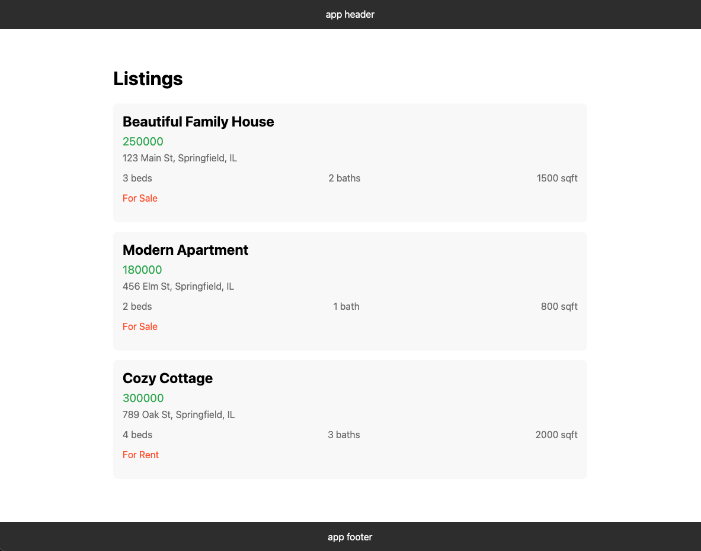
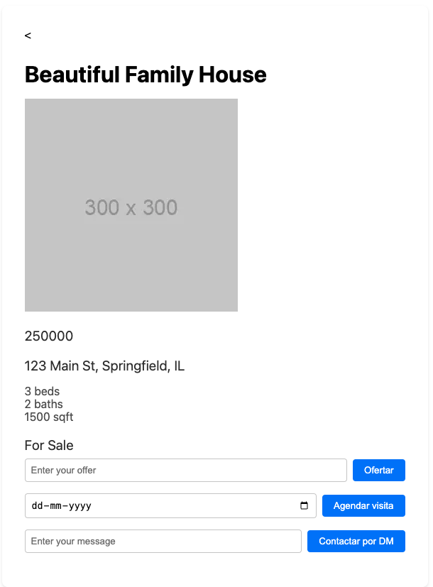

# Real Estate App

## Description

This is a simple application to render a list of items of a json mock file, and to show the details of each item.

## Screenshots

### Main View


### Item Details


## Installation

Before you start, make sure you have Node.js installed on your machine. Then, run the following command to install the application:

```bash
npm install
```

## Usage

To view the application on your browser, run the following command and go to `http://localhost:3000`:

```bash
npm run dev
```

## Features

- Render a list of items from a JSON mock file
- Show detailed information for each item

## Components

- Items: Renders the list of items.
- ItemRow: Represents a single item in the list.

## API

- fetchItems: Fetches the items from the JSON mock file.
- fetchItems: Fetches the item from the JSON mock file based on id.

## Styles

- layout.scss: Contains the main styles for the application layout.
- page.scss: Contains the styles for the item details page.
